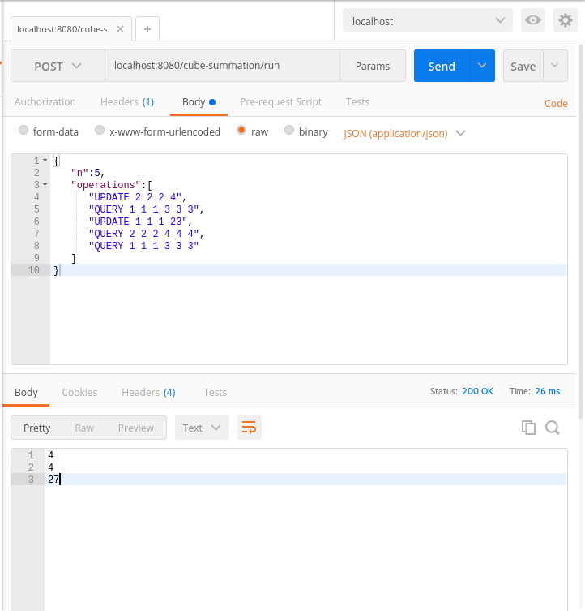
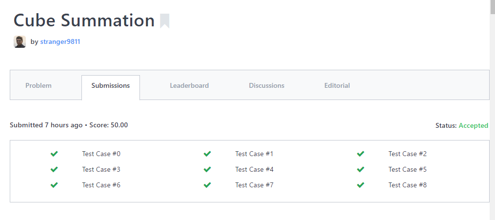
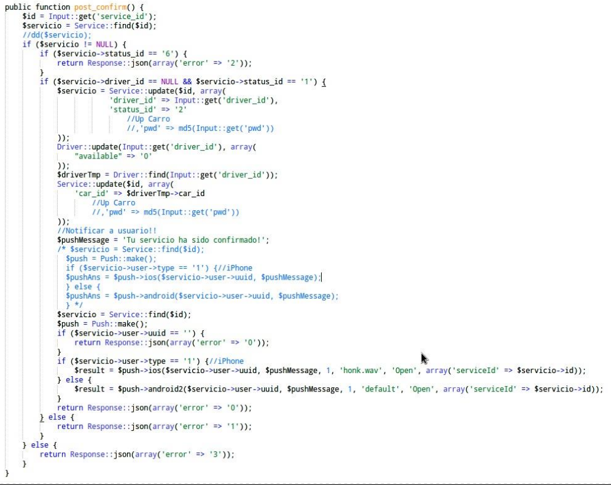

#### 1 - Coding Challenge

La primera parte de la prueba consiste en un Coding Challenge tomado de Hackerrank (...) Una vez hayas terminado el código describa en un documento
brevemente:
1. Las capas de la aplicación (por ejemplo capa de persistencia, vista, de aplicación, etc)
y qué clases pertenecen a

2. La responsabilidad de cada clase creada

|Clase   |Función   | Capa  |
|---|---|---|
|domain.FenwickTree.java   | Esta clase se encarga de las operaciones sobre el árbol que simula el cubo   | Capa de aplicación   |
|domain.Point3D.java   | Esta clase modela un punto 3D. A pesar de que en el proyecto solo sirve de placeholder, decidí colocarla como una entidad en si misma en caso de querer extender el código en el futuro   | Capa de aplicación  |
| domain.TestCase   | Esta clase se encarga de modelar un caso de prueba de la aplicación. En este sentido, para la entrada Web vía API, el usuario envía un JSON representando un objeto TestCase  | Capa Web - API  |
|utils.Solution   | Clase para el submit vs HackerRank   | Capa de aplicación   |
| service.CubeSummationService.java   | Clase encargada de gestionar el servicio Web para la consulta de sumatoria de cubos  |Capa Web - API   |
| web.Config.java  | Clase de configuración de la aplicación. En este caso, la clase se encarga de establecer que la aplicación es Web basada en Jersey, además de hacer el binding del CubeSummationService para la inyección de dependencias en la capa del recurso Web.  | Capa Web - API|
| web.CubeSummationResource.java  | Clase resource que define los endpoints y el payload del API. En esta clase y mediante inyección de dependencias se hace la asociación entre el recurso web y la capa que se comunica con el core de la aplicación| Capa Web - API / Capa de Vista  |
| test.java.FenwickTreeTest.java  | En esta clase se realizan pruebas unitarias respecto al funcionamiento del Fenwick Tree basado en dos casos de prueba presentes en HackerRank  |  Capa de aplicación  |

###### Anexos

* Ejemplo de llamada a API Rest - *URL:PORT/cube-summation/run*




* Resultados en HackerRank




#### 2 - CODE REFACTORING (20 puntos)



Refactorice y envíe el código y en un documento explique las malas prácticas de programación que en su criterio son evidenciadas en el código y cómo su refactorización supera las malas prácticas de programación

* En el caso del manejo de errores, se retornan cosas como ```error => 2```, lo cual es poco intuitivo y propenso a errores de mantenimiento. En vez de ello, es preferible usar una alternativa a los tipos de datos enum. Ya que estos no son nativos en PHP, se puede utilizar una clase utilitaria para ello:


    abstract class Error  
    {
        const Error01 = 0;
        const Error02 = 1;
        // etc.
    }

    $error = Error::Error01;

* Al momento de armar la respuesta, si esta tiene un error, es recomendable incluir en el cuerpo un código de error HTPP, así en caso de llamadas desde servicios externos se tiene una forma estándar de reaccionar antes los errores


      return Response::json([
          'body' => $body
      ], 201); // Status code here

* La llamada a mensajería PUSH debe estar en un método separado:


      public function push($pushMessage, $userUUID){
      // Push logic here
      }


* De igual forma, la lógica para el update del driver también debería estar en un método aparte: es una funcionalidad potencialmente común, y aislarla permite extenderla más fácilmente en el futuro

* El código tiene un alto nivel de líneas de código comentadas. A pesar de que no es algo malo del todo, es recomendable realizar periodicamente una limpieza de código buscando segmentos del mismo que ya no se utilizan.

* A nivel de uso de base de datos, se puede mejorar el performance llamando solo una vez a funciones que se llaman repetidamente como Service::Update(...)


#### 3 - PREGUNTAS (10 puntos)
Responde y envía en un documento las siguientes preguntas:

1. ¿En qué consiste el principio de responsabilidad única? ¿Cuál es su  propósito?

      El principio de responsabilidad única es una directriz del desarrollo orientado a objetos, cuyo basamento se basa en que cada clase debe poseer una y sola una responsabilidad dentro del software que compone, encapsulada totalmente en su interior. Una consecuencia directa de ello es que la clase solo tendrá un "único punto de cambio".

      El cumplimiento de esta directriz permite, en teoría, que los cambios dentro de una clase sean mínimos y además tengan un impacto menor en el resto de las clases del producto de software.

2. ¿Qué características tiene según tu opinión "buen" código o código limpio?

      En mi opinión, un buen código se resume en:

      * Posee un buen nivel de claridad: en la medida de lo posible, se debería evitar el código confuso u obscuro, en pro de hacerlo fácil de entender para desarrolladores involucrados en el proyecto.
      * Documentación extensa, con el nivel de detalle necesario que permita que otro desarrollador pueda tomar el control del mismo en una forma lo más directa posible.
      * Cumple con buenas prácticas de programación, incluidas las normas de estilo del lenguaje en el que está desarrollado (identación, ubicación de llaves, operadores, etc.)
      * Debe estar fundamentando con pruebas de unidad, para garantizar la estabilidad del código frente a los cambios.
      * Adicionalmente, debe haberse tomado en cuenta durante el desarrollo la optimización. En este sentido, a pesar de que la optimización temprana es contraproducente, siempre debe haber un espacio que permita extender/editar el programa con el menor impacto posible con tal de mejorar su performance/uso de recursos.
